# IISAGE ATAC-seq Pipeline v2.0 - Flowchart

## Complete Pipeline Architecture

## Simplified High-Level Flow

## Data Flow by Stage

```mermaid
graph TD
    subgraph "Input Data"
        FASTQ[FASTQ Files<br/>*_1.fq.gz, *_2.fq.gz]
        CONFIG[config.yaml<br/>Species Configuration]
        META[sample_metadata.csv<br/>Sample Information]
        REF[Reference Genome<br/>FASTA + GTF]
    end

    subgraph "Stage 1: Trimming & Alignment"
        TRIM[Trimmed Reads<br/>paired.fastq]
        SAM[Aligned Reads<br/>aligned.sam]
        BAM[Sorted BAM<br/>sorted.bam + .bai]
    end

    subgraph "Stage 2: Peak Calling"
        FILT[Size-selected BAM<br/>≤100bp fragments]
        PEAKS[Peak Files<br/>narrowPeak, xls, summits]
    end

    subgraph "Stage 3: DeepTools"
        BIGWIG[BigWig Tracks<br/>.bw files]
        MATRIX[Coverage Matrix<br/>TSS regions]
        CORR[Correlation Plots<br/>PNG]
    end

    subgraph "Stage 4: R Analysis"
        VENN[Venn Diagrams<br/>PNG]
        ANNOT[Peak Annotations<br/>CSV]
        MOTIFS[Motif Results<br/>HTML]
        TABLES[Feature Tables<br/>CSV]
        CONSENSUS[Consensus Peaks<br/>BED]
    end

    subgraph "Final Outputs"
        SUMMARY[Pipeline Summary<br/>TXT]
        VERSIONS[Software Versions<br/>TXT]
        FIGS[Figures Directory<br/>All visualizations]
    end

    FASTQ --> TRIM
    CONFIG --> TRIM
    TRIM --> SAM
    SAM --> BAM
    BAM --> FILT
    FILT --> PEAKS
    FILT --> BIGWIG
    FILT --> MATRIX
    MATRIX --> CORR
    PEAKS --> VENN
    PEAKS --> ANNOT
    META --> VENN
    REF --> ANNOT
    PEAKS --> MOTIFS
    REF --> MOTIFS
    PEAKS --> TABLES
    PEAKS --> CONSENSUS
    VENN --> FIGS
    ANNOT --> FIGS
    MOTIFS --> FIGS
    TABLES --> FIGS
    CONSENSUS --> FIGS
    BAM --> SUMMARY
    PEAKS --> SUMMARY
    FIGS --> SUMMARY
    CONFIG --> VERSIONS
```

## Parallel Processing (Array Jobs)

## Checkpoint System

## Error Handling Flow

---

## Legend

| Symbol | Meaning |
|--------|---------|
| 🟦 **Stage** | Main pipeline stage (1-4) |
| 🟨 **Decision** | Conditional branching point |
| 🟥 **Error** | Error exit point |
| 🟩 **Process** | Data processing step |
| 🟪 **Checkpoint** | Resume capability marker |

## Key Features Highlighted

1. **Array Processing:** Samples processed in parallel for speed
2. **Checkpoint System:** Resume from failure without reprocessing
3. **Modular Stages:** Each stage can be enabled/disabled independently
4. **Error Resilience:** Non-critical failures don't stop pipeline
5. **Validation:** Multiple validation steps ensure data integrity

